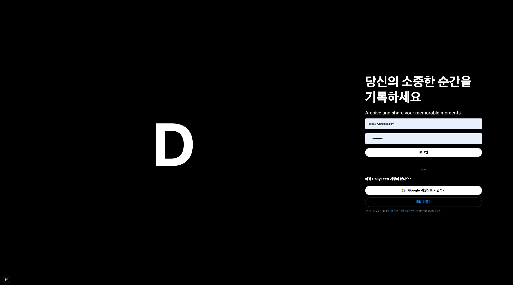
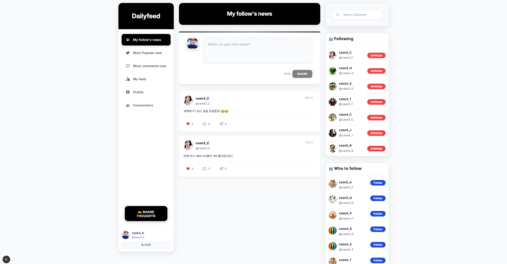
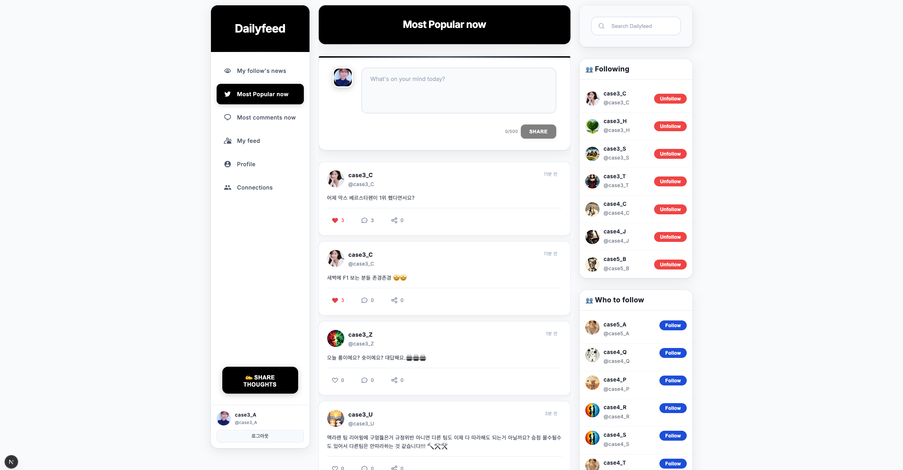
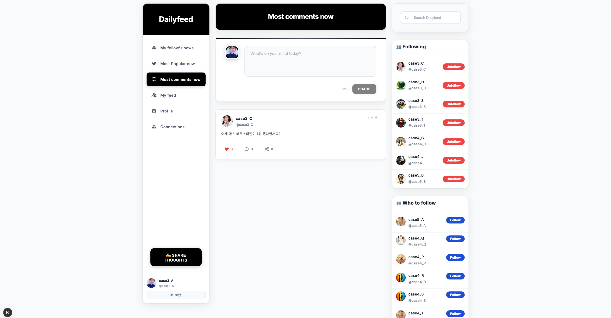
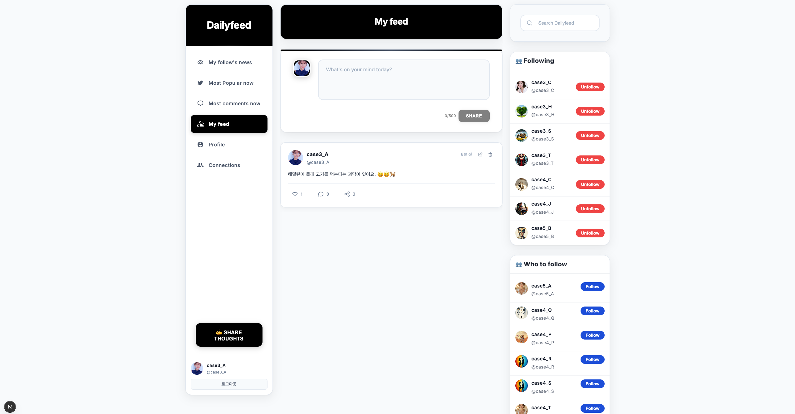
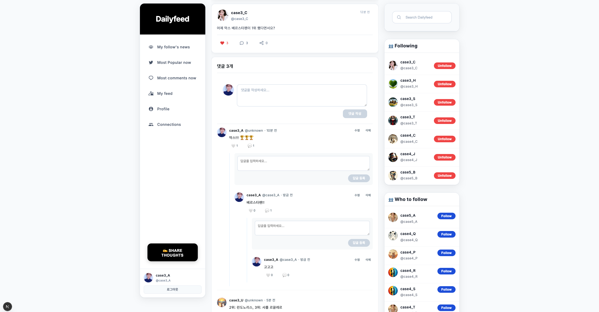
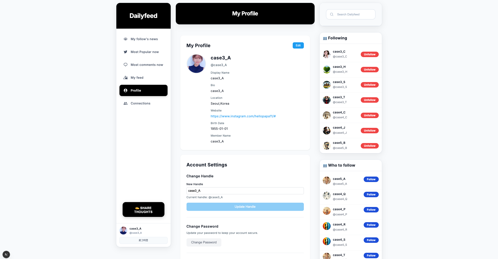
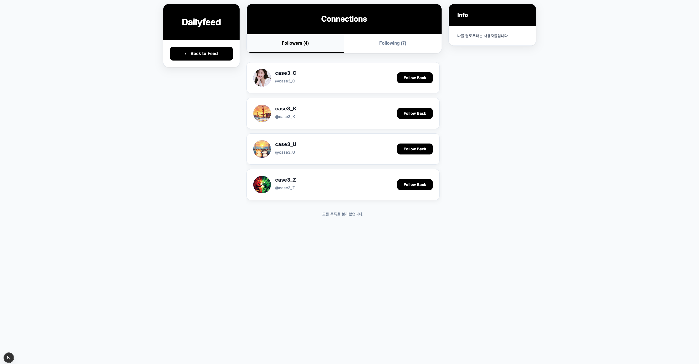
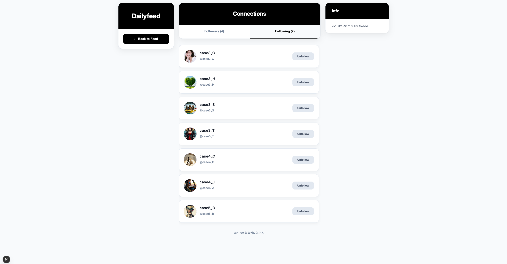

# Dailyfeed 소개
아직은 프로젝트 문서를 작성중입니다. 10월 마지막주에 모두 완료될 예정입니다.

# 프로젝트 설명
사용자가 회원가입 후 로그인을 해서 다른 사용자를 팔로우를 하고, 팔로잉 중인 멤버의 글들을 확인하는 SNS 형태의 프로젝트입니다. k8s 환경에서 인스턴스를 어떻게 구분하는 것이 좋은지에 초점을 맞춰서 설계를 했습니다. 

member-activity 서비스의 경우 season2 에서는 삭제 예정이지만, 실무에서 kafka 를 쓸때 '메시지 유실' 관점에서의 PVC/MongoDB 영속화, 'Exactly Once' 를 Off 했을때 메시지의 중복수신 체크방법 등에 대해 다루기 위해 불가피하게 시나리오 기반으로 추가한 서비스입니다. Kafka 대신 feign 기반의 통신을 할 경우 어떻게 하는 지에 대해서도 예제를 작성했습니다. 

개인적으로는 kubernetes 환경이 갖춰져 있다면, 웹소켓, 메시징 등의 상태없는 통신이 아닌 이상 Kafka/RabbitMQ 를 도입하기 보다는 kubernetes 기반의 스케일아웃이 용이한 환경을 통해 Feign 으로 통신을 하고, 통신실패의 경우 실시간 배치를 통해 후보정하는 것이 좋다고 생각합니다. 

## 로그인 페이지

로그인 페이지입니다. 이메일 회원가입이 가능합니다.

 

## My follow's news

내가 팔로우 하고 있는 멤버들이 작성한 글들을 최근 작성 순으로 확인할 수 있습니다.

 

## Most popular now

가장 인기있는 글들을 확인할 수 있습니다. (조회수 + 좋아요 x 2)

 

## Most comments now

댓글 많이 달린 글들을 조회합니다.

 

## My feed

내가 작성한 글들을 확인합니다.

 

## Post 상세

글 상세 화면입니다.

 

## Profile

프로필 페이지입니다. 프로필을 수정하거나 썸네일을 수정할 수 있습니다.

 

## Connections

follow, following 목록을 확인할 수 있는 페이지입니다.

 

 

 

# github

설치
- https://github.com/alpha3002025/dailyfeed-installer
  - https://github.com/alpha3002025/dailyfeed-infrastructure : kind,mysql,kafka,redis,configmap 등을 설치 및 관리
  - https://github.com/alpha3002025/dailyfeed-app-helm : 애플리케이션의 helm 및 설치 스크립트를 관리

- 

계정 서비스

- https://github.com/alpha3002025/dailyfeed-member-svc
  - https://github.com/alpha3002025/dailyfeed-code
  - https://github.com/alpha3002025/dailyfeed-member
  - https://github.com/alpha3002025/dailyfeed-feign-support
  - https://github.com/alpha3002025/dailyfeed-redis-support

콘텐츠 서비스

- https://github.com/alpha3002025/dailyfeed-content-svc
  - https://github.com/alpha3002025/dailyfeed-code
  - https://github.com/alpha3002025/dailyfeed-content
  - https://github.com/alpha3002025/dailyfeed-feign-support
  - https://github.com/alpha3002025/dailyfeed-redis-support
  - https://github.com/alpha3002025/dailyfeed-kafka-support

timeline 서비스 (피드, 인기있는글들, 댓글많은 글, 댓글수 카운팅 등, 조회에 관련된 기능을 담당)

- https://github.com/alpha3002025/dailyfeed-timeline-svc
  - https://github.com/alpha3002025/dailyfeed-code
  - https://github.com/alpha3002025/dailyfeed-timeline
  - https://github.com/alpha3002025/dailyfeed-pvc-support
  - https://github.com/alpha3002025/dailyfeed-feign-support
  - https://github.com/alpha3002025/dailyfeed-redis-support
  - https://github.com/alpha3002025/dailyfeed-kafka-support

이미지 (e.g. 썸네일) 서비스

- https://github.com/alpha3002025/dailyfeed-image-svc
  - https://github.com/alpha3002025/dailyfeed-code
  - https://github.com/alpha3002025/dailyfeed-image
  - https://github.com/alpha3002025/dailyfeed-feign-support

검색(e.g. 본문검색, Full Text Search) 서비스

- https://github.com/alpha3002025/dailyfeed-search-svc
  - https://github.com/alpha3002025/dailyfeed-code
  - https://github.com/alpha3002025/dailyfeed-search
  - https://github.com/alpha3002025/dailyfeed-feign-support

멤버 활동 기록 서비스

- https://github.com/alpha3002025/dailyfeed-activity-svc
  - https://github.com/alpha3002025/dailyfeed-code
  - https://github.com/alpha3002025/dailyfeed-activity
  - https://github.com/alpha3002025/dailyfeed-feign-support
  - https://github.com/alpha3002025/dailyfeed-pvc-support
  - https://github.com/alpha3002025/dailyfeed-redis-support
  - https://github.com/alpha3002025/dailyfeed-kafka-support

배치 서비스
- https://github.com/alpha3002025/dailyfeed-batch-svc
  - https://github.com/alpha3002025/dailyfeed-code
  - https://github.com/alpha3002025/dailyfeed-batch
  - https://github.com/alpha3002025/dailyfeed-pvc-support
  - https://github.com/alpha3002025/dailyfeed-redis-support

