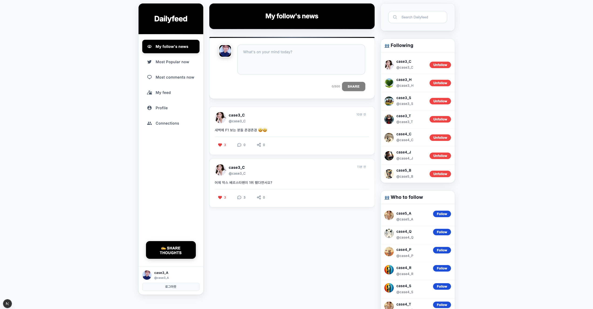
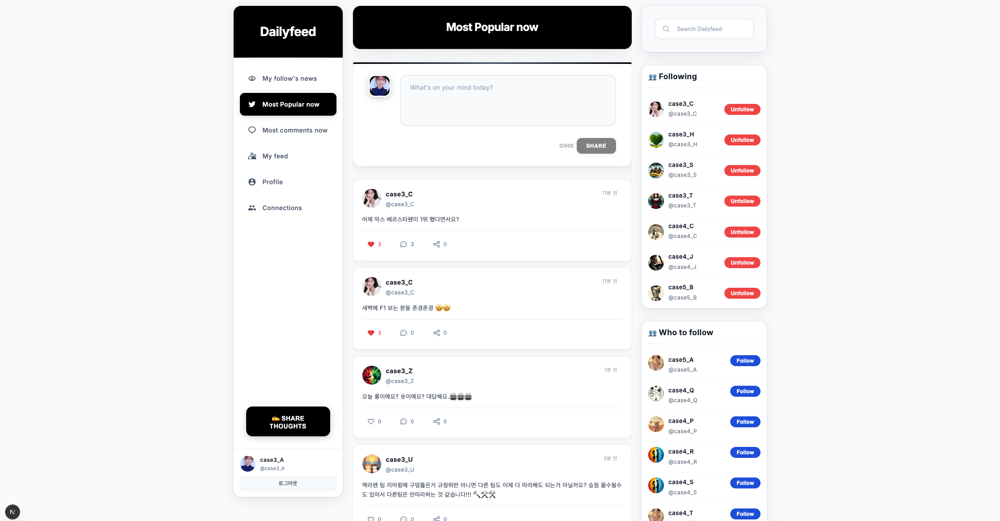
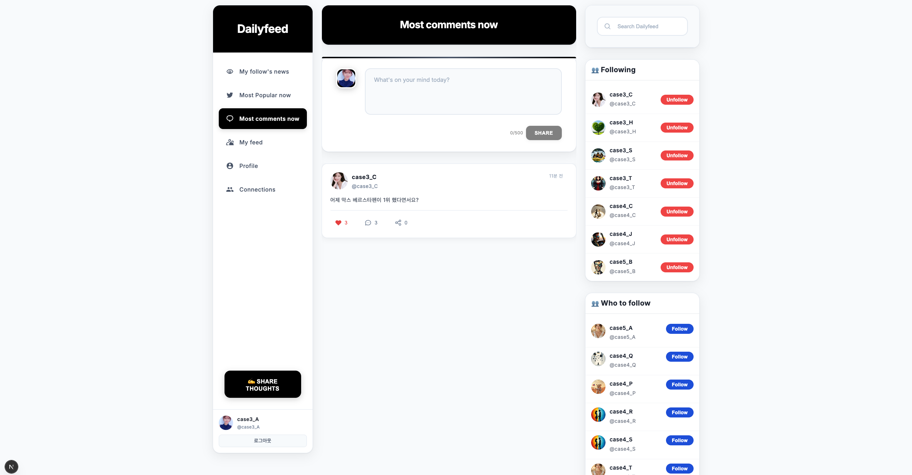
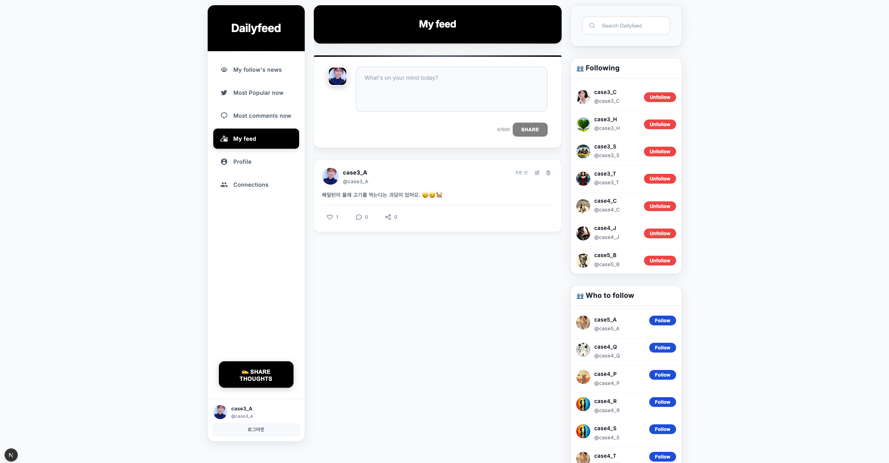
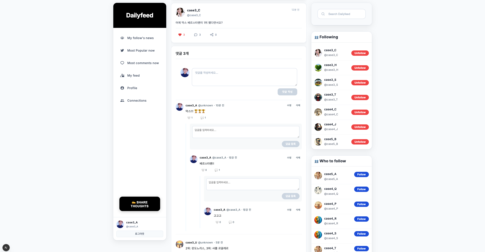
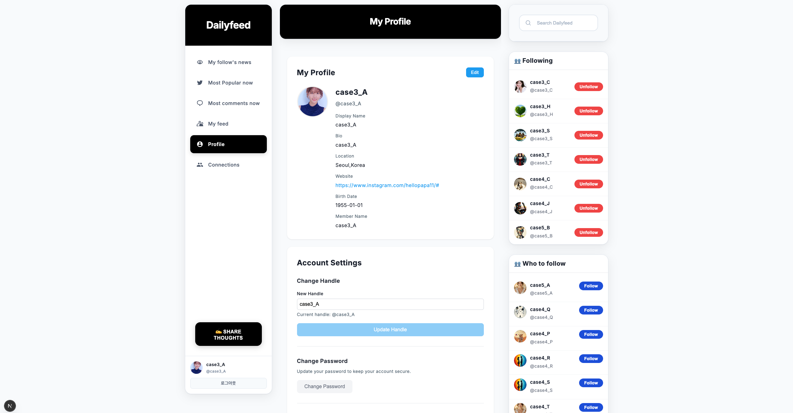
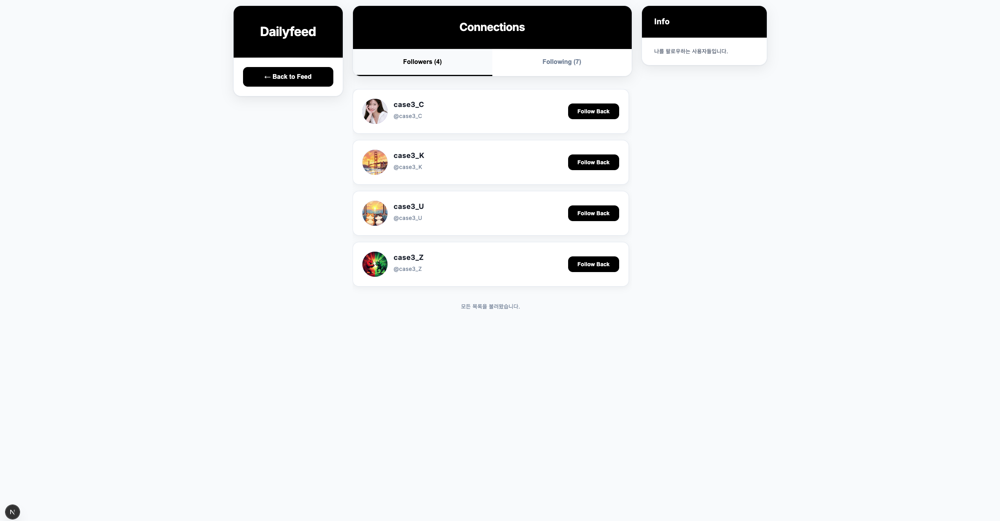
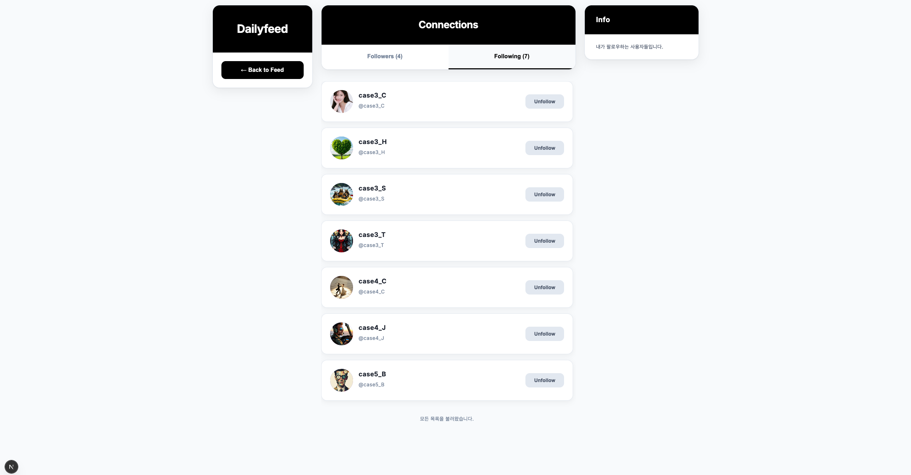

> obsidian (https://obsidian.md) 를 통해 현재 리포지터리 디렉터리를 열어서 확인하시면 조금 더 가독성 높게 내용을 파악하실수 있습니다.

 

# Dailyfeed 소개

> 참고) ~dev 프로필 사용시 사용 가능 시간~
> - ~비용 이슈로 인해 매일 9:00 \~ 18:00 까지만 RDS 를 켜두고 있습니다. Atlas MongoDB 역시 9:00 이후에 Network Access 를 공개하기에 dev 프로필의 경우 9:00 이후로 확인이 가능합니다.~
> - (2025.12.11) 비용 이슈로 인해 dev 프로필은 현재 운영하지 않습니다. 비용이슈로 RDS를 제거하게 되면서 dev 프로필도 더 이상 관리하지 않기로 했습니다.

 

# 프로젝트 설명
사용자가 회원가입 후 로그인을 해서 다른 사용자를 팔로우를 하고, 팔로잉 중인 멤버의 글들을 확인하는 SNS 형태의 프로젝트입니다. k8s 환경에서 인스턴스를 어떻게 구분하는 것이 좋은지에 초점을 맞춰서 설계를 했습니다. 
백엔드 애플리케이션은 단순하다면 단순하고, 세부적으로 들어가면 복잡한 부분도 보이지만, 제가 infra 설치스크립트를 만들때 과도하게 local,dev 에서 어떤 사람이든 스크립트 하나로 모두 설치되게 해주고 싶다는 생각을 했던 것 같습니다. 현재 프로젝트는 이 친구가 애플리케이션을 주로 어떻게 구성하는 것을 최선의 선택으로 보는지 만약 레거시가 없을때 어떤 선택을 할지에 대한 주관식 질문지에 대한 답변이라고 이쁘게 봐주셨으면합니다. 저는 이 프로젝트 진행 시에 인프라 설치 스크립트 작업을 제일 못한 것 같습니다. 
프로젝트 마무리 당시에 installer 라는 프로젝트로 로컬에서 모든 인프라도 사용할수 있도록 하고 local, dev 프로필을 분류해서 모두 스크립트 하나로 설치할 수 있게끔 하느라 2주에서 3주 정도 시간을 허비했었고 입이 바짝마르기도 했던 기억이 있네요. 카프카 설치를 k8s 내에서 helm 으로 설치하다가 docker-compose 로 전환하고 별짓을 다했는데 다시 한다면 메시징 인프라는 로컬에서 하더라도 절대 도커를 사용하게 되지는 않을 것 같네요. 

요약하자면, 백엔드 애플리케이션 설계시 어떤 관점과 어떤 지식을 가지고 있을지에 초점을 맞춰주셨으면 합니다. 현재는 k8s 인프라 설치에 관련해서 terraform 과 atlantis 기반으로 eks 와 주요 인프라 설치, 앱 배포시 주요 속성이 노출되지 않게하는 방법에 대한 문서화를 진행 중인데, 이것과 관련된 eks 관련 실습 프로젝트와 가이드문서를 조만간 공개할 예정입니다. 
 

> 2026.04.01
> - HPA 최적화를 위해 Resource, Requests/Limit 을 맞춰나갔던 작업 역시 꽤 힘든 작업이었습니다. 실무에서 k8s 를 적용할 때 user-svc, post-svc 이런 식으로 배포했을 경우 새로 추가되는 기능이 어느 정도의 리소스를 잡아먹을지 판단이 쉽지 않아지고 잠재적인 장애를 유발할수 있다는 점 역시 알게되었던 것 같습니다. 작년 여름에 이 프로젝트를 끝내고, 취업준비를 위헤 코딩테스트 준비를 하는 동안 잠시 프로젝트를 접어뒀다가 다시 프로젝트를 돌아보니 HPA 적용시에 각 서비스별 리소스의 최소/최대치를 설계하는 작업 역시 물리적인 시간을 상당히 많이 잡아먹었던 힘들었던 작업이었다고 생각합니다. 그 당시에는 리소스 스펙을 체크하는 데에 이렇게 시간을 잡아먹고(1주일정도)나니 자괴감이 들었던 기억이 있었는데 사람 마음이 간사하다고 힘든 기억을 잊고 있다가 k8s 의 Scheduling 파트를 복습해보는 과정에서 떠올랐네요!! 
 

# 프로젝트 문서
pdf 로 정리한 문서는 다음과 같습니다. 
- [dailyfeed 프로젝트 설명문서.pdf (다운로드 페이지로 이동)](./dailyfeed-project-설명문서.pdf) 
- https://github.com/alpha3002025/dailyfeed-readme-season1/blob/main/dailyfeed-%ED%94%84%EB%A1%9C%EC%A0%9D%ED%8A%B8-%EC%84%A4%EB%AA%85%EB%AC%B8%EC%84%9C-2025.pdf
 
 

현재 문서는 새로운 버전으로 작성해두었습니다. 이 리포지터리는 외부에 공개하고 있지 않습니다.
- https://nextradocs-dailyfeed-season1.vercel.app/

 

만약 조금 더 상세하고 TMI 에 가까운 설명문서를 확인하고 싶으시다면 다음 링크를 확인해주세요.
- [tmi-docs/Readme.md](./tmi-docs/Readme.md)

 
 

# 주요 기능
## 로그인 페이지

로그인 페이지입니다. 이메일 회원가입이 가능합니다.

 
 

## My follow's news

내가 팔로우 하고 있는 멤버들이 작성한 글들을 최근 작성 순으로 확인할 수 있습니다.

 

## Most popular now

가장 인기있는 글들을 확인할 수 있습니다. (조회수 + 좋아요 x 2)

 

## Most comments now

댓글 많이 달린 글들을 조회합니다.

 

## My feed

내가 작성한 글들을 확인합니다.

 

## Post 상세

글 상세 화면입니다.

 

## Profile

프로필 페이지입니다. 프로필을 수정하거나 썸네일을 수정할 수 있습니다.

 

## Connections

follow, following 목록을 확인할 수 있는 페이지입니다.

 

 

 

# github
**설치**
> infra 설치, helm 차트

- Project: https://github.com/alpha3002025/dailyfeed-installer
  - module: https://github.com/alpha3002025/dailyfeed-infrastructure : kind,mysql,kafka,redis,configmap 등을 설치 및 관리
  - module: https://github.com/alpha3002025/dailyfeed-app-helm : 애플리케이션의 helm 및 설치 스크립트를 관리
   

**Frontend**
> Next.js App Router 기반의 애플리케이션이며, Frontend 학습을 위해 2주 이상을 학습했었지만, 막상 프로젝트를 하다보니 시간관리를 위해 95% 이상의 코드를 AI(Claude Code)를 이용해 개발하게 되었습니다. 

- Project: https://github.com/alpha3002025/dailyfeed-frontend-svc
 

**계정 서비스**
- Project: https://github.com/alpha3002025/dailyfeed-member-svc
  - module: https://github.com/alpha3002025/dailyfeed-code
  - module: https://github.com/alpha3002025/dailyfeed-member
  - module: https://github.com/alpha3002025/dailyfeed-feign-support
  - module: https://github.com/alpha3002025/dailyfeed-redis-support
   

**콘텐츠 서비스**
- Project: https://github.com/alpha3002025/dailyfeed-content-svc
  - module: https://github.com/alpha3002025/dailyfeed-code
  - module: https://github.com/alpha3002025/dailyfeed-content
  - module: https://github.com/alpha3002025/dailyfeed-feign-support
  - module: https://github.com/alpha3002025/dailyfeed-redis-support
  - module: https://github.com/alpha3002025/dailyfeed-kafka-support
   

**timeline 서비스**
> 피드, 인기있는글들, 댓글많은 글, 댓글수 카운팅 등, 조회에 관련된 기능을 담당

- Project: https://github.com/alpha3002025/dailyfeed-timeline-svc
  - module: https://github.com/alpha3002025/dailyfeed-code
  - module: https://github.com/alpha3002025/dailyfeed-timeline
  - module: https://github.com/alpha3002025/dailyfeed-pvc-support
  - module: https://github.com/alpha3002025/dailyfeed-feign-support
  - module: https://github.com/alpha3002025/dailyfeed-redis-support
  - module: https://github.com/alpha3002025/dailyfeed-kafka-support
   

**image 서비스**
> 서비스 (e.g. 썸네일)

- Project: https://github.com/alpha3002025/dailyfeed-image-svc
  - module: https://github.com/alpha3002025/dailyfeed-code
  - module: https://github.com/alpha3002025/dailyfeed-image
  - module: https://github.com/alpha3002025/dailyfeed-feign-support
   

**검색 서비스**
> (e.g. 본문검색, Full Text Search)

- Project: https://github.com/alpha3002025/dailyfeed-search-svc
  - module: https://github.com/alpha3002025/dailyfeed-code
  - module: https://github.com/alpha3002025/dailyfeed-search
  - module: https://github.com/alpha3002025/dailyfeed-feign-support
   

**멤버 활동 기록 서비스**
- Project: https://github.com/alpha3002025/dailyfeed-activity-svc
  - module: https://github.com/alpha3002025/dailyfeed-code
  - module: https://github.com/alpha3002025/dailyfeed-activity
  - module: https://github.com/alpha3002025/dailyfeed-feign-support
  - module: https://github.com/alpha3002025/dailyfeed-pvc-support
  - module: https://github.com/alpha3002025/dailyfeed-redis-support
  - module: https://github.com/alpha3002025/dailyfeed-kafka-support
   

**배치 서비스**
- Project: https://github.com/alpha3002025/dailyfeed-batch-svc
  - module: https://github.com/alpha3002025/dailyfeed-code
  - module: https://github.com/alpha3002025/dailyfeed-batch
  - module: https://github.com/alpha3002025/dailyfeed-pvc-support
  - module: https://github.com/alpha3002025/dailyfeed-redis-support

 
