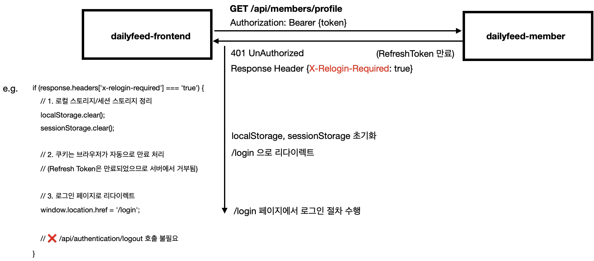

# member 서비스 설명
> claude 의 힘을 빌리지 않은 지극히 주관적인 설명 문서입니다.

dailyfeed-member 는 JWT 기반의 인증을 사용합니다. AccessToken → RefreshToken → 로그아웃 시에는 Blacklist 등록 절차를 가집니다. 
 

# 목차
- [Readme](./Readme.md)
- [0\. JWT 관리](./0.%20JWT%20관리.md)
- [1\. 인증 흐름](./1.%20인증%20흐름.md)
- [2\. logout 그리고 Blacklist](./2.%20logout%20그리고%20Blacklist.md)
- [3\. 서비스간 통신 시 인증 유효성 체크](./3.%20서비스간%20통신%20시%20인증%20유효성%20체크.md)
- [3\. ArgumentResolver 기반 인증 유효성 체크](./3.%20ArgumentResolver.md)

 

# 주요 시나리오

## 로그인

 

## accessToken 만료시 

 

## refreshToken 만료시
- e.g. 로그인한 후 오랫동안 미접속

 

## 로그아웃

# Notice
## OAuth2 는 Season 1 에서는 배제
OAuth 기반의 인증 (OAuth2.0, 구글로그인) 을 도입하려 했지만 다음의 이유들로 인해 배제하기로 했습니다.
- 구글 심사 등의 과정이 오래걸린다는 점 : 시간 상 3개월 안에 다른 프로젝트의 구현까지 완료하고 문서까지 작성해야 했기 때문에 개발 기한상 불가능하다고 판단
- 구글 인증 관련 local/dev 개발환경 구축 후 공개시 API 키/시크릿 공유를 해야할 수도 있다는 점
	- 이 부분에 대해서는 Season2 에서 다양한 방법을 도입해둘 예정입니다.

