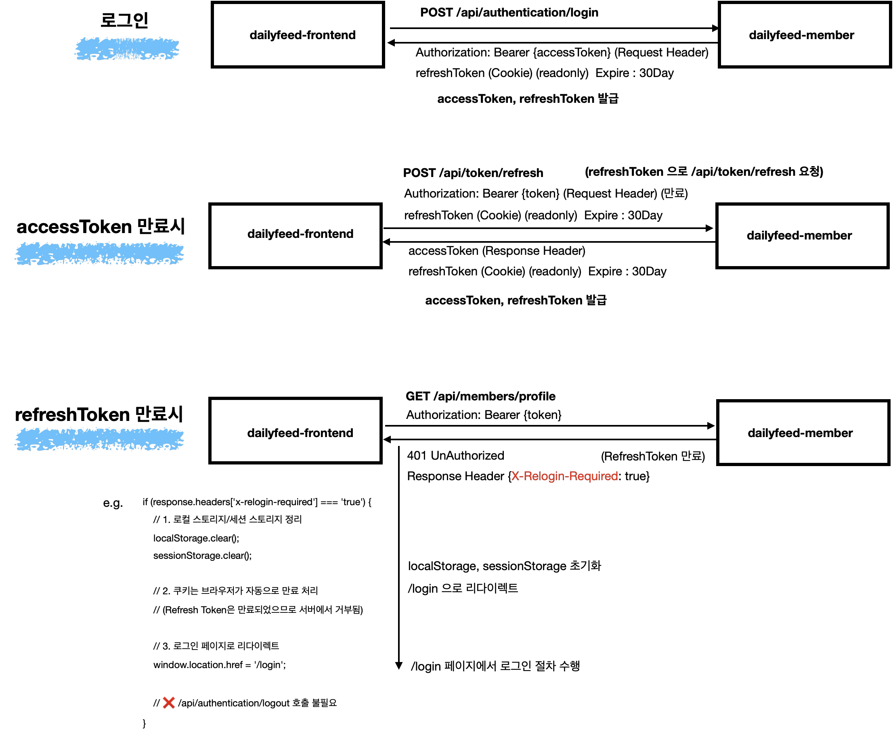

# member 서비스 설명
claude 의 힘을 빌리지 않은 지극히 주관적인 설명 문서입니다.

---
# Intro
JWT 기반의 인증을 사용합니다. AccessToken → RefreshToken → 로그아웃 시에는 Blacklist 등록 절차를 가집니다.

---
# Notice 
## (참고) OAuth2 는 Season 1 에서는 배제
OAuth 기반의 인증 (OAuth2.0, 구글로그인) 을 도입하려 했지만 다음의 이유들로 인해 배제하기로 했습니다.
- 구글 심사 등의 과정이 오래걸린다는 점 : 시간 상 3개월 안에 다른 프로젝트의 구현까지 완료하고 문서까지 작성해야 했기 때문에 개발 기한상 불가능하다고 판단
- 구글 인증 관련 local/dev 개발환경 구축 후 공개시 API 키/시크릿 공유를 해야할 수도 있다는 점
	- 이 부분에 대해서는 Season2 에서 다양한 방법을 도입해둘 예정입니다.

---
# 요약
dailyfeed-member-svc 를 설명하기에 앞서 먼저 주요하게 사용한 개념/기능 들에 대해 간략한 요약을 해서 전반적인 내용을 훑어봅니다. 
 

## JWT 유효성 체크 : AOP(x) → ArgumentResolver(o)
**AOP(x) → ArgumentResolver(o)** 

요청 헤더의 JWT 인증 체크를 수행하는 로직은 모두 ArgumentResolver 를 사용했습니다.
인증 체크의 경우 흔히 AOP 를 이용해 JWT 를 분해하고 검사하거나 유효한 사용자인지를 조회하는 것이 보편적인 선택이 될수도 있을 것 같습니다.
하지만 dailyfeed-member-svc 의 경우 **ArgumentResolver를 이용한 인증방식**을 선택했습니다. 
 

AOP 를 사용하지 않은 이유
- AOP 의 경우 Controller 외부에서도 사용될 수 있다는 점을 감안해야하고 
- 지나친 AOP 의존은 공통로직의 비대화 + 결합도 증가 를 불러온다고 판단
 

ArgumentResolver 를 사용한 이유
- Web 을 통해 전달받은 파라미터를 통해 검증한다는 목적에 정확하게 부합해서 ArgumentResolver 를 선택했습니다.
- Web 요청 외에는 사용되지 않기에 오용될 소지가 적다는 점 역시 선택에 한몫 했습니다.
 

주요 ArgumentResolver
- MemberProfileSummaryArgumentResolver 
	- content-svc, timeline-svc, search-svc, image-svc, activity-svc 등의 서비스에서 frontend 의 요청을 수행 전 합당한 사용자인지 검사를 위해 MemberFeignHelper 를 통해 GET /api/members/profile 을 수행하는 역할을 합니다.
	- `401 UnAuthorized, {X-Token-Refress-Needed: true}`응답헤더를 받을 경우 `POST /api/token/refresh` 를 유도 
	- `401 UnAuthorized, {X-Relogin-Required: true}` 응답헤더를 받을 경우 재로그인 유도
	- `@AuthenticatedMemberProfileSummary` 어노테이션이 붙은 웹 파라미터에 대해 동작하는 ArgumentResolver 입니다.
- AuthenticatedMemberInternalArgumentResolver
	- member-svc 서비스에서 frontend 및 다른 백엔드 서비스(content-svc,timeline-svc,search-svc,image-svc,activity-svc)로부터의 합당한 사용자인지를 묻는 경우에 대한 처리를 수행합니다.
	- 주로 GET /api/members/profile 에 대한 조회 시에 `AuthenticatedMemberInternalArgumentResolver` 를 사용하게 됩니다. 
	- `GET /api/members/profile` 의 경우 자주 사용되는 API 이기에 Redis Caching 처리 되어 있습니다.
	- `@InternalAuthenticatedMember` 어노테이션이 붙은 웹 파라미터에 대해 동작하는 ArgumentResolver 입니다.

 

## 서비스간 통신 시 인증 유효성 체크
서비스간 통신 시 에는 JWT 를 주고받으면서 인증된 사용자인지 검증합니다. 이때 서버 비공개키가 Refresh 된 경우, AccessToken 이 만료된 경우, RefreshToken 이 만료된 경우  이렇게 세 가지 경우의 인증 관련 시나리오가 존재합니다.

서버 비공개 키가 Refresh 된 경우
- `401 UnAuthorized, {X-Token-Refress-Needed: true}` 응답 헤더를 전파해서 클라이언트에서 POST /api/token/refresh 를 하도록 유도합니다.
- `POST /api/token/refresh` 를 수행하고 나면 새로운 AccessToken, RefreshToken 을 부여받게 됩니다.
- `POST /api/token/refresh` 는 frontend 에서 refreshToken 을 이용해서 요청하며, 서버에서도 refreshToken 을 읽어서 유효한지 검사합니다.
- Feign 관련 로직 내에 `401 UnAuthorized, {X-Token-Refress-Needed: true}`를 만났을 때에 대한 처리 로직이 있으며 `dailyfeed-feign` 모듈에 해당 기능들이 존재합니다.

AccessToken 이 만료되었을 경우
- `401 UnAuthorized, {X-Token-Refress-Needed: true}` 응답 헤더를 전파해서 클라이언트에서 POST /api/token/refresh 를 하도록 유도합니다.
- `POST /api/token/refresh` 를 수행하고 나면 새로운 AccessToken, RefreshToken 을 부여받게 됩니다.
- `POST /api/token/refresh` 는 frontend 에서 refreshToken 을 이용해서 요청하며, 서버에서도 refreshToken 을 읽어서 유효한지 검사합니다.
- Feign 관련 로직 내에 `401 UnAuthorized, {X-Token-Refress-Needed: true}`를 만났을 때에 대한 처리 로직이 있으며 `dailyfeed-feign` 모듈에 해당 기능들이 존재합니다.

RefreshToken 이 만료되었을 경우
- `401 UnAuthorized, {X-Relogin-Required: true}` 응답 헤더를 전파해서 login 을 새로 수행하도록 유도합니다.
- Feign 관련 로직 내에 `401 UnAuthorized, {X-Relogin-Required: true}`를 만났을 때에 대한 처리 로직이 있으며 `dailyfeed-feign` 모듈에 해당 기능들이 존재합니다.

 

# 주요 시나리오
주요 시나리오는 다음과 같습니다.

